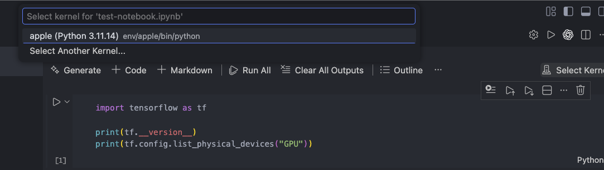
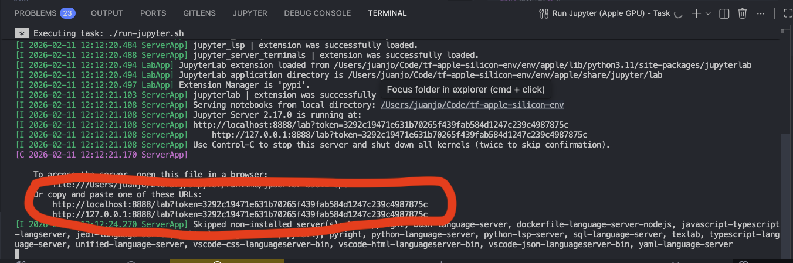
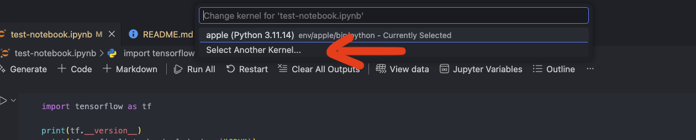
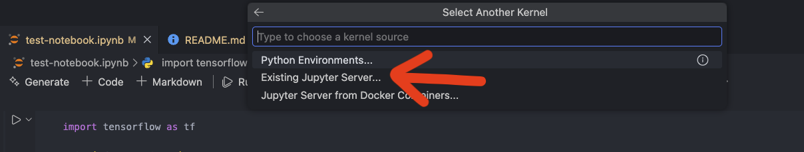
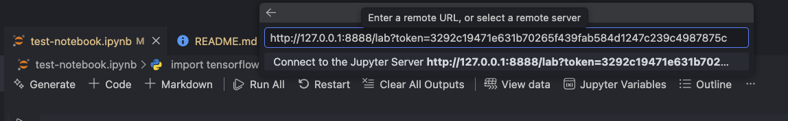
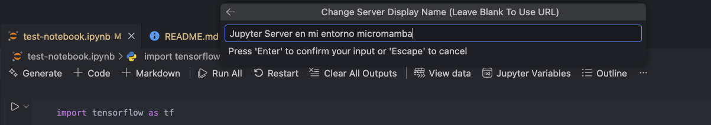
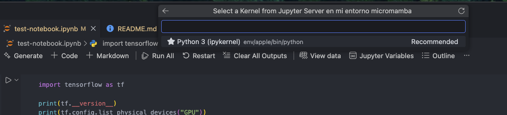

# Entorno reproducible TensorFlow + Jupyter en Apple Silicon (GPU) - como un contenedor pero sin Docker

## Intención del repositorio

Este repositorio proporciona un entorno de desarrollo reproducible para proyectos de Deep Learning basados en Jupyter Notebooks que:
* funciona **nativamente en macOS sobre Apple Silicon (M1, M2, M3, ...)**
* permite **usar la GPU del chip Apple** a través de **TensorFlow + Metal**
* **no interfiere** con ninguna instalación global de Python existente (pyenv, conda, system Python, etc.)
* sigue la **filosofía de contenedores**, aunque no usa Docker (por las limitaciones de GPU en macOS)
* puede lanzarse y usarse **directamente desde VS Code**, sin tocar el shell del sistema

La idea central es:

> Un entorno autocontenido, reproducible y desechable, como un contenedor, pero compatible con la GPU de Apple Silicon.

⸻

## Estructura del repositorio

```
.
├── environment.yml        # Definición del entorno TensorFlow Apple
├── bootstrap.sh           # Crea el entorno de forma local y autocontenida
├── run-jupyter.sh         # Lanza Jupyter usando ese entorno
├── test-notebook.ipynb    # Notebook de ejemplo
├── .vscode/
│   ├── tasks.json         # Tareas de VS Code
│   └── settings.json      # Configuración de Python/Jupyter
└── README.md
```

Nada fuera de este directorio se ve afectado.

⸻

## Dependencias y entorno

El entorno se define en environment.yml y se crea usando micromamba, descargado localmente por el propio proyecto.

Incluye:
* Python 3.10
* TensorFlow 2.11
* tensorflow-metal (backend GPU para Apple Silicon)
* JupyterLab
* dependencias científicas habituales (numpy, pandas, matplotlib, scikit-learn)

El entorno:
* **no se registra globalmente**
* **no se activa en la shell**
* se usa **sólo cuando los scripts del proyecto lo invocan**

⸻

## Cómo usar el repositorio

### 1. Abre el proyecto en VS Code

Abre la carpeta del repositorio en VS Code. No es necesario configurar nada en tu terminal ni activar entornos manualmente.


### 2. Crea el entorno (una sola vez)

Desde VS Code:

1.	Cmd + Shift + P
2.	**Run Task &rarr; Bootstrap TensorFlow Apple env**

Esto ejecuta `bootstrap.sh`, que:
* descarga micromamba en el proyecto
* crea el entorno en `./env/apple`
* instala todas las dependencias

Si el entorno ya existe, no se vuelve a crear.

### 3. (a) Usa Jupyter Notebooks desde VS Code (sin Jupyter server)

Opción recomendada: conectar VS Code con el kernel del entorno micromamba sin Jupyer server
1.	Abre un notebook (v.g. `test-notebook.ipynb` que viene incluido en este repo) en VS Code
2.	En la esquina superior derecha de la ventana de edición, presiona donde dice **"Select Kernel"**

3.	Elige la primera opción que te sale, que debe llamarse algo así como **"apple (Python 3.11.x)"** donde `3.11.x` es la versión exacta que te haya instalado:

4.	Pega la URL del servidor que lanzó la tarea

A partir de ese momento:
* el notebook se ejecuta usa **el entorno TensorFlow Apple** local
* tiene **acceso a la GPU**

### 3. (b) Lanza Jupyter Server y ejecuta el Notebook desde VS Code en él

Desde VS Code:
1.	Cmd + Shift + P
2.	**Run Task &rarr; Run Jupyter (Apple GPU)**.
Esto lanza un **Jupyter Lab local**, pero **usando exclusivamente el Python del entorno del proyecto**. La salida del terminal mostrará una URL similar a `http://127.0.0.1:8888/lab?token=...`
cópiala, pero no la que comienza por `http://localhost:8888/lab?token=...`

El servidor queda corriendo mientras la tarea esté activa.
3.	Ahora abre un notebook (v.g. `test-notebook.ipynb` que viene incluido en este repo) en VS Code
4.	En la esquina superior derecha de la ventana de edición, presiona donde dice **"Select Kernel"**

5. Ahora selecciona **"Select Another Kernel"**

6. Ahora **"Existing Jupyter Server"**

7. A continuación te pedirá la URL y ahora es cuando tienes que pegar la que copiaste antes:

8. Ahora te pedirá que le des un nombre a este servidor, pon cualquier cosa:

9. Por último te pedirá que elijas un kernel dentro del Jupyter Server, sólo te mostrará uno, elígelo:


A partir de ese momento:
* el notebook se ejecuta **en ese servidor**
* usa **el entorno TensorFlow Apple**
* tiene **acceso a la GPU**

### 5. Verifica que la GPU está activa

En cualquier celda del notebook:
```python
import tensorflow as tf

tf.config.list_physical_devices("GPU")
```

La salida esperada es algo similar a:
```
[PhysicalDevice(name='/physical_device:GPU:0', device_type='GPU')]
```

Si aparece una GPU listada, TensorFlow está usando Metal correctamente.

⸻

## Desinstalación

Eliminar el entorno es tan simple como:
```shell
rm -rf env mamba
```


⸻

## Notas importantes sobre TensorFlow + Apple Silicon (Metal)

Al trabajar con **TensorFlow sobre Apple Silicon (M1/M2/…) usando `tensorflow-metal`**, existen algunas **limitaciones conocidas del backend Metal** que requieren pequeños ajustes en el código para evitar errores en tiempo de ejecución.

En **TensorFlow / `tf.keras` 2.11**, la capa `keras.layers.LeakyReLU` **no acepta** el argumento `alpha`.

El parámetro correcto es **`negative_slope`**, por lo que se debe usar:
```python
keras.layers.LeakyReLU(negative_slope=0.2)  # no soportado en tf.keras 2.11
```
y no:
```python
keras.layers.LeakyReLU(alpha=0.2)
```